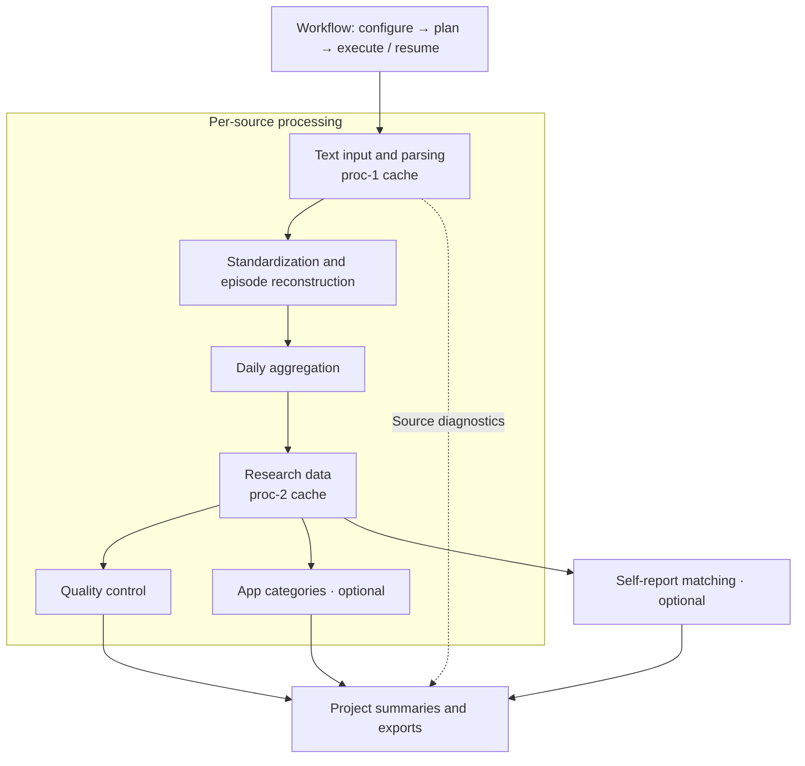

# appusageR 

appusageR converts APP Usage / Screen Time Android text exports into structured
data for behavioral and mobile-sensing research.
Its architecture separates callable data-processing modules from a workflow
that configures, sequences, and resumes their execution.
Two per-source cache levels connect these modules: faithful parsed data
(`proc-1`) and research data containing events, episodes, and daily summaries
(`proc-2`).

<br clear="right" />



The computational modules operate on R objects.
The workflow adds file access, content-based cache validation, stage records,
and project outputs.

## Installation

```r
install.packages("remotes")
remotes::install_github("fenmeng123/appusageR")
library(appusageR)
```

## Workflow and recovery

The workflow combines module settings with execution controls in one configuration.
Its plan explains which source and project stages will run, reuse results, or remain blocked.
Execution validates current inputs and caches, then resumes the affected stages.

- `appusage_config()` sets parsing, timezone, reconstruction, daily, QC,
  category, matching, and execution options.
- `plan_appusage_workflow()` previews source tasks and project tasks.
- `run_appusage_workflow()` executes a plan or resumes a saved project.
- `run_appusage_stage()` runs `parse`, `research_data`, `qc`, `category`,
  `matching`, or `summary` independently.

```r
config <- appusage_config(time = list(tz = "Asia/Shanghai"))
plan <- plan_appusage_workflow(
  c("raw/a.txt", "raw/b.txt"), "outputs/study", config
)
print(plan)
result <- run_appusage_workflow(plan = plan)
result <- run_appusage_workflow(project_dir = "outputs/study")
summary(result)
```

## Text input and parsing

This module decodes text and detects the line, meta, day, and app export formats.
The parsers retain the native records and source diagnostics.
The first-level runner combines these steps and can save a parsed `proc-1` cache.

- `read_appusage_text()` reads and decodes input; `detect_appusage_type()`
  identifies its content.
- `parse_line()`, `parse_meta()`, `parse_day()`, and `parse_app()` parse
  individual exports; `parse_meta()` returns separate summary and event tables.
- `run_first_level_appusage()` processes one source; `read_appusage_batch()`
  processes a file collection.

## Standardization and episodes

Standardization gives native records consistent columns, app identities, and numeric millisecond values.
Episode reconstruction pairs meta start and end events and merges contiguous use of the same app.
The resulting foreground timeline resolves overlapping episodes and retains their original durations in audit fields.

- `standardize_appusage()` prepares common event, episode, and daily inputs.
- `reconstruct_meta_episodes()` builds episodes from parsed meta events.
- `run_second_level_appusage()` composes standardization, reconstruction,
  and daily aggregation into research data.

## Daily aggregation

This module summarizes app use by local calendar date.
It splits episodes at local midnight using the configured timezone.
For meta exports, daily values come from the native summary by default, with options to retain episode-derived estimates or both sources as labeled rows.

- `build_appusage_daily()` aggregates standardized data and optional meta
  episodes; `meta_daily_source` selects `"summary"`, `"episodes"`, or `"both"`.

## Quality control

QC evaluates daily coverage, duration anomalies, and source-level inconsistencies.
It records flags and analysis eligibility for each available data grain.
Workflow reports present execution status, QC findings, and eligibility separately.

- `assess_appusage_qc()` evaluates research data in memory.
- `qc_appusage_anomalies()` inspects event, episode, and daily anomalies.
- `write_qc_metadata_batch()` refreshes QC metadata and project summaries.

## App categories

This optional module attaches categories from a user-supplied dictionary.
It matches package names first, followed by exact, unambiguous app-name matches.
It adds category fields and reports unmatched apps for manual review.

- `read_app_category_dictionary()` loads a dictionary.
- `add_app_categories()` annotates an R object; `write_app_categories_batch()`
  updates project caches.
- `extract_uncoded_apps()` collects apps requiring dictionary entries.

## Self-report matching

This optional module links questionnaire rows to available APP Usage sources.
It matches sequence IDs and uploaded filenames, then resolves multiple candidates by export type and timestamp.
It retains unmatched questionnaire rows alongside the resolved source relationships.

- `match_appusage_self_report()` matches a questionnaire data frame against
  a source manifest.
- `run_appusage_project_workflow()` adapts Wenjuanxing project folders and
  workbooks to the shared workflow and writes matched Excel output.

## Cache summaries and exports

Each source has paired RDA and JSON caches for parsed and research data.
Project summaries combine source identities, stage outcomes, QC, categories, and matching information.
The summary stage rebuilds these projections from valid caches, while object inspection provides a compact overview.

- `run_appusage_stage("summary", project_dir)` refreshes project summaries
  and enabled matching exports.
- `rebuild_first_level_summary_from_cache()` rebuilds the first-level source
  summary.
- `print()` and `summary()` inspect plan and workflow results.

For configuration details and examples, see the
[workflow guide](vignettes/appusageR-workflow.Rmd).
Version history and development records are in [NEWS.md](NEWS.md).

Author: Kunru Song · <Kunrusong97@gmail.com>

License: [GPL-3](LICENSE)
